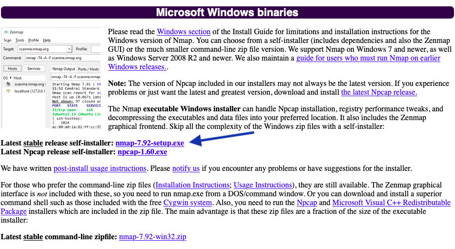

# Preparation for SheLeadsTech 25 June 2022 session

We will be using _nmap_ for doing basic vulnerability assessments and penetration testing exercises. You should bring a laptop with Windows 10 or Windows 11 installed. If you are bringing an office laptop, make sure you have administrative rights. If you are bringing your personal laptop, then you should have the administrative rights by default.

If you are having problem with this software installation, don't sweat it. Come for the session and get help.


### What is NMAP?

[nmap](https://nmap.org/) is a software tool commonly used to probe for open services or ports. It can either send IPv4 or IPv6 probes and is the mainstay for most vulnerability assessments and penetration testing engagements. We will be using this tool for the session.

If you have a laptop running Kali Linux or macOS, the installation steps will be different from Windows and can also be found below


## Prerequisites
1. A laptop with wifi, running either Windows 10 or Windows 11.
2. An account with administrative access to install NMAP.
3. Understand how to disable the Antivirus software on your laptop.


## Windows: Steps to install nmap on your laptop

1. Go to [nmap](https://nmap.org/download#windows) and download the executable that says `nmap-7.92-setup.exe` using your favourite web browser



2. Upon downloading, install the application by double-clicking on it.
3. Verify it works by executing the application. To do so, click on the Windows button (Lower left corner) and type `cmd`
4. Then `nmap` You should see lines scrolling down the terminal. Scrolling upwards you will see:
```
Nmap 7.92 ( https://nmap.org )
Usage: nmap [Scan Type(s)] [Options] {target specification}
TARGET SPECFIICATION:
  Can pass hostnames, IP addresses, networks, etc
  Ex: scanme.nnmap.org, microsoft.com/24, 192.168.0.1; 10.0.0-255.1-254
  ...
```
5. You're ready for the session.


## macOS: Steps to install nmap on your laptop

By default, macOS does not come with either the Homebrew or the Macports package managers. You will need to install either one (definitely not both)

A. If you are using Homebrew
1. Run the Terminal application (Applications > Utilities > Terminal)
2. Now to update Homebrew  `sudo brew update`
3. Install nmap  `sudo brew install nmap`
4. Start a terminal session and type `nmap` The following messages should appear
```
Nmap 7.xx ( https://nmap.org )
Usage: nmap [Scan Type(s)] [Options] {target specification}
TARGET SPECFIICATION:
  Can pass hostnames, IP addresses, networks, etc
  Ex: scanme.nnmap.org, microsoft.com/24, 192.168.0.1; 10.0.0-255.1-254
  ...
```
5. You're ready for the session.

B. If you are using Macports
1. Run the Terminal application (Applications > Utilities > Terminal)
2. Now to update Homebrew  `sudo port update`
3. Install nmap  `sudo port install nmap`
4. Start a terminal session and type `nmap` The following messages should appear
```
Nmap 7.xx ( https://nmap.org )
Usage: nmap [Scan Type(s)] [Options] {target specification}
TARGET SPECFIICATION:
  Can pass hostnames, IP addresses, networks, etc
  Ex: scanme.nnmap.org, microsoft.com/24, 192.168.0.1; 10.0.0-255.1-254
  ...
```
5. You're ready for the session.


## Linux (Debian-based distributions): Steps to install nmap on your laptop

APT is the default package manager in Debian-based distributions, together with Kali Linux.

1. Update the apt repository `sudo apt update`
2. Install nmap  `sudo apt install nmap`
3. Start a terminal session and type `nmap` The following messages should appear
```
Nmap 7.xx ( https://nmap.org )
Usage: nmap [Scan Type(s)] [Options] {target specification}
TARGET SPECFIICATION:
  Can pass hostnames, IP addresses, networks, etc
  Ex: scanme.nnmap.org, microsoft.com/24, 192.168.0.1; 10.0.0-255.1-254
  ...
```
4. You're ready for the session.


## Linux (RHEL-based distributions): Steps to install nmap on your laptop

DNF is the default package manager in RHEL-based distributions; for example CENTOS, Fedora Red Hat Enterprise Linux.

1. Update the yum repository `sudo dnf update`
2. Install nmap  `sudo dnf install nmap`
3. Start a terminal session and type `nmap` The following messages should appear
```
Nmap 7.xx ( https://nmap.org )
Usage: nmap [Scan Type(s)] [Options] {target specification}
TARGET SPECFIICATION:
  Can pass hostnames, IP addresses, networks, etc
  Ex: scanme.nnmap.org, microsoft.com/24, 192.168.0.1; 10.0.0-255.1-254
  ...
```
4. You're ready for the session.


